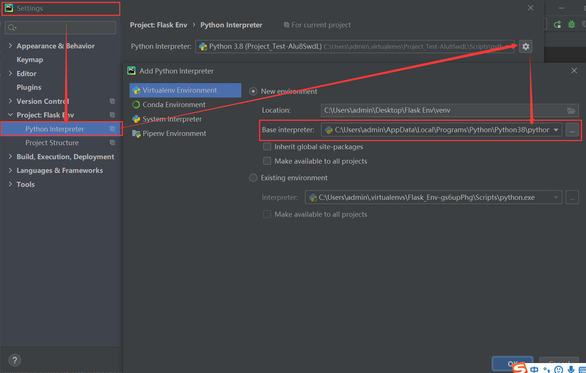

# pipenv 虚拟化


# 1. pip 软件包管理

## 1.1 pip 常用命令

```cmd
$ pip --verison
$ pip list
$ pip freeze > requirements.txt
$ pip install -r requirements.txt
```


## 1.2 pip 命令行帮助

```cmd

C:\Users\admin\Desktop\Pipenv>pip

Usage:
  pip <command> [options]

Commands:
  install                     Install packages.
  download                    Download packages.
  uninstall                   Uninstall packages.
  freeze                      Output installed packages in requirements format.
  list                        List installed packages.
  show                        Show information about installed packages.
  check                       Verify installed packages have compatible dependencies.
  config                      Manage local and global configuration.
  search                      Search PyPI for packages.
  cache                       Inspect and manage pip's wheel cache.
  wheel                       Build wheels from your requirements.
  hash                        Compute hashes of package archives.
  completion                  A helper command used for command completion.
  debug                       Show information useful for debugging.
  help                        Show help for commands.
```


## 1.3 pip 实例演示

```cmd
C:\Users\admin\Desktop\Pipenv>pip --version
pip 20.2.1 from c:\users\admin\appdata\local\programs\python\python38\lib\site-packages\pip (python 3.8)

C:\Users\admin\Desktop\Pipenv>pip list
Package          Version
---------------- ----------
appdirs          1.4.4
certifi          2020.6.20
distlib          0.3.1
filelock         3.0.12
pip              20.2.1
pipenv           2018.11.26
setuptools       49.2.1
six              1.15.0
virtualenv       20.0.35
virtualenv-clone 0.5.4
WARNING: You are using pip version 20.2.1; however, version 20.2.4 is available.
You should consider upgrading via the 'c:\users\admin\appdata\local\programs\python\python38\python.exe -m pip install --upgrade pip' command.

C:\Users\admin\Desktop\Pipenv>pip freeze
appdirs==1.4.4
certifi==2020.6.20
distlib==0.3.1
filelock==3.0.12
pipenv==2018.11.26
six==1.15.0
virtualenv==20.0.35
virtualenv-clone==0.5.4
```


# 2. pipenv 虚拟化工具

## 2.1 pipenv 包安装

- （1）安装命令

```cmd
$ pip list
$ pip install pipenv
```


- （2）实例演示

```cmd
# （1）使用pip安装 pipenv 软件包
$ pip install pipenv

Collecting pipenv
  Downloading pipenv-2020.11.4-py2.py3-none-any.whl (3.9 MB)
     |████████████████████████████████| 3.9 MB 386 kB/s
...
Installing collected packages: pipenv
Successfully installed pipenv-2020.11.4

# （2）查看pipenv 安装版本信息，检查是否安装成功；
$ pipenv --version
pipenv, version 2020.11.4
```


## 2.2 虚拟环境激活

### 2.2.1 激活命令

```cmd
# 在指定项目目录下创建虚拟化环境（即，安装python虚拟化环境）
$ pipenv install --three //指定python版本为 3

# 激活命令
$ pipenv shell

# 环境查看
$ python --version
$ pip list
```

### 2.2.2 实例演示

- （1）创建项目虚拟化环境

在命令行终端切换到“项目工作目录”，使用如下命令创建虚拟化环境，准备python虚拟化环境。

```cmd
# （1）切换到项目目录下
$ cd env_project

# （2）创建虚拟化环境
$ pipenv install --three  //指定python版本安装
或，使用系统默认包安装；
$ pipenv install
Creating a Pipfile for this project...
Pipfile.lock not found, creating...
Locking [dev-packages] dependencies...
Locking [packages] dependencies...
Updated Pipfile.lock (db4242)!
Installing dependencies from Pipfile.lock (db4242)...
  ================================ 0/0 - 00:00:00
To activate this project's virtualenv, run pipenv shell.
Alternatively, run a command inside the virtualenv with pipenv run.
```

- （2）查看项目虚拟化环境

```cmd
# （1）激活虚拟化环境目录
$ pipenv shell
Launching subshell in virtual environment...
Windows PowerShell
版权所有 (C) Microsoft Corporation。保留所有权利。

尝试新的跨平台 PowerShell https://aka.ms/pscore6

# （2）查看python虚拟化信息

$ pip list
Package    Version
---------- -------
pip        20.2.3
setuptools 50.3.1
wheel      0.35.1

$ python --version
Python 3.8.6
```


## 2.3 虚拟化环境使用

虚拟化环境激活后，我们就可以直接使用 pip 进行软件的部署和安装了，这里演示安装 flask 包；

```cmd
$ pip install flask
Collecting flask
  Using cached Flask-1.1.2-py2.py3-none-any.whl (94 kB)
Collecting itsdangerous>=0.24
  Using cached itsdangerous-1.1.0-py2.py3-none-any.whl (16 kB)
Collecting click>=5.1
  Using cached click-7.1.2-py2.py3-none-any.whl (82 kB)
Collecting Jinja2>=2.10.1
  Using cached Jinja2-2.11.2-py2.py3-none-any.whl (125 kB)
Collecting Werkzeug>=0.15
  Using cached Werkzeug-1.0.1-py2.py3-none-any.whl (298 kB)
Collecting MarkupSafe>=0.23
  Using cached MarkupSafe-1.1.1-cp38-cp38-win_amd64.whl (16 kB)
Installing collected packages: itsdangerous, click, MarkupSafe, Jinja2, Werkzeug, flask
Successfully installed Jinja2-2.11.2 MarkupSafe-1.1.1 Werkzeug-1.0.1 click-7.1.2 flask-1.1.2 itsdangerous-1.1.0

$ pip list
Package      Version
------------ -------
click        7.1.2
Flask        1.1.2
itsdangerous 1.1.0
Jinja2       2.11.2
MarkupSafe   1.1.1
pip          20.2.3
setuptools   50.3.1
Werkzeug     1.0.1
wheel        0.35.1
```


## 2.4 pycharm 中集成使用

在pycharm中，我们直接在 `settings - project - python interpreter` 指定` "C:\Users\admin\.virtualenvs\Flask_Env-gs6upPhg\Scripts\python.exe"`集成接环境即可。

> - 在windows中，虚拟环境文件夹会在`C:\Users\woshi\.virtualenvs\`目录下创建；
>
> - 在linux或mac中，虚拟环境目录则会在`~/.local/share/virtualenvs/`目录下创建。虚拟环境文件夹名称会以**当前项目目录名+一串随机字符**命名，例如`demo01-f6WazQPd`.




# 3. pipenv 学习小结

## 3.1 pipenv 虚拟化环境创建

- （1）pipenv 安装

```cmd
$ pip install pipenv

# 查看安装情况
$ pipenv --version
```

- （2）虚拟化环境创建；

```cmd
# 创建python虚拟化环境
$ pipenv install --three
```

- （3）虚拟化环境激活；

```cmd
# 激活python虚拟化环境；
$ pipenv shell
# 查看python虚拟化激活情况
$ python --version
$ pip install
```

- （4）项目虚拟化环境使用；

```cmd
$ pip install flask
$ pip list
```

- （5）pycharm 中集成使用

```cmd
直接配置pycharm虚拟化环境类型为pipenv,指定解析器到"默认目录"。
- windowns 默认目录：C:\Users\woshi\.virtualenvs\
- Linux 默认目录：~/.local/share/virtualenvs/
```


## 3.2 学习参考文档

### 3.2.1 官方使用说明

https://github.com/pypa/pipenv

### 3.2.2 知乎参考文档

https://zhuanlan.zhihu.com/p/163023998
